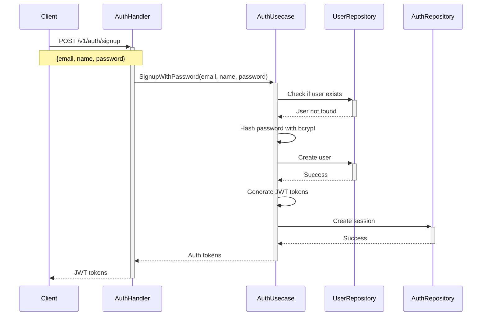
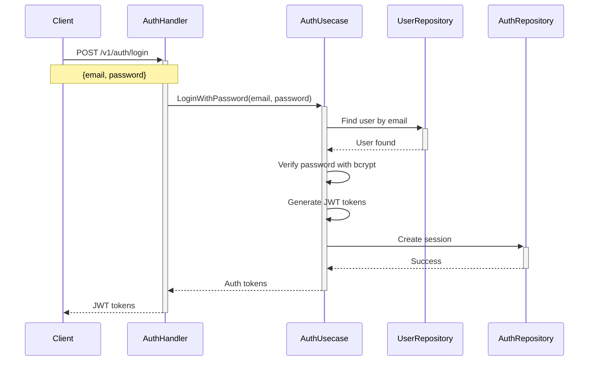
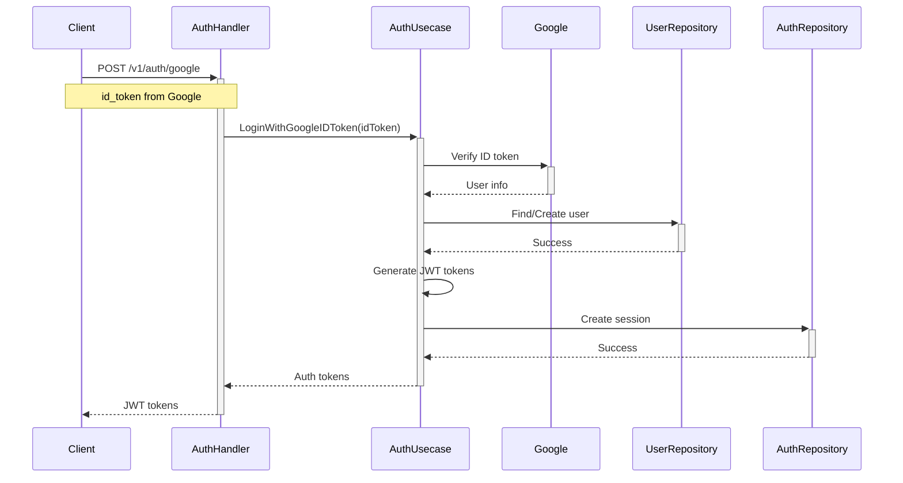
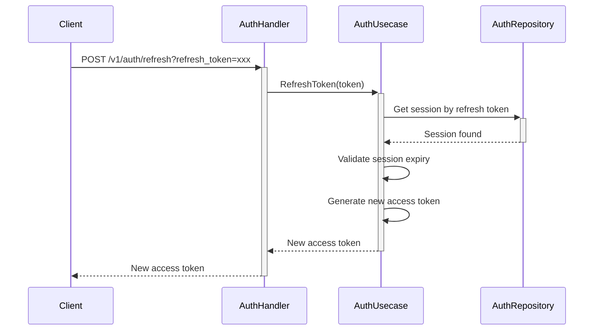
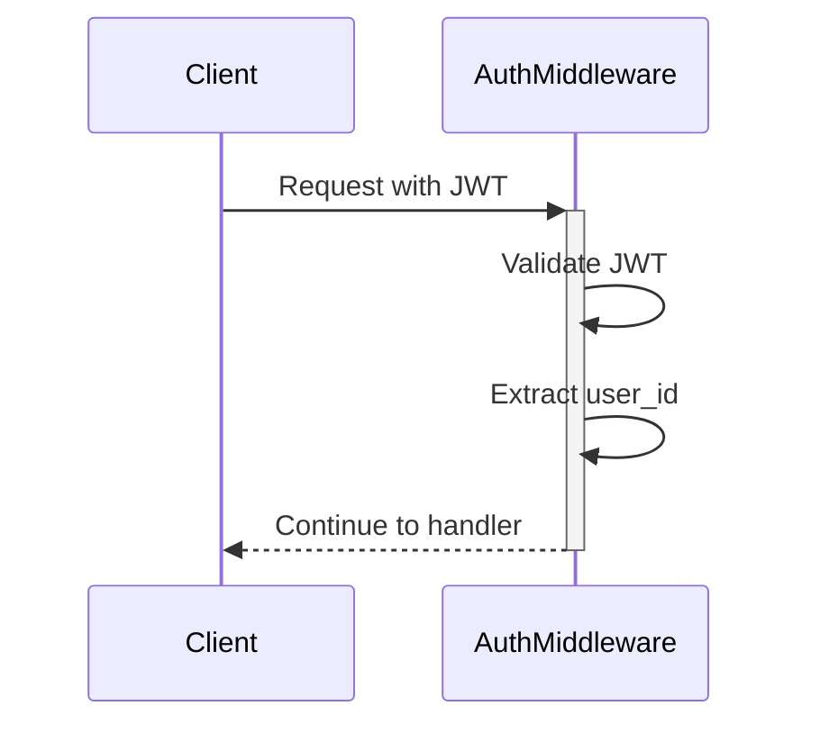
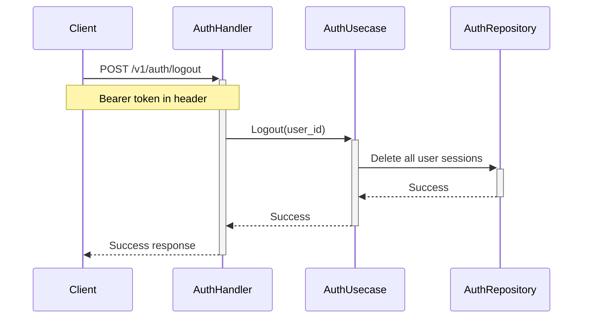

# Authentication Flow

## Overview

Jeki menggunakan dua metode autentikasi:
1. **Password-based Authentication** - Email dan password tradisional
2. **Google OAuth 2.0** - Autentikasi melalui Google

Kedua metode menggunakan JWT untuk manajemen session. Flow autentikasi terdiri dari beberapa komponen utama:

1. **AuthHandler** - Menangani HTTP requests terkait autentikasi
2. **AuthUsecase** - Mengimplementasikan logika bisnis autentikasi
3. **AuthRepository** - Mengelola data autentikasi di database
4. **AuthMiddleware** - Memvalidasi JWT token untuk protected routes

## Flow Autentikasi

### 1. Password-based Signup



### 2. Password-based Login



### 3. Google OAuth Login



### 4. Token Refresh



### 5. Protected Route Access



### 6. Logout



## Komponen

### AuthHandler

Menangani HTTP requests terkait autentikasi:
- `Signup` - Registrasi user dengan email dan password
- `Login` - Login user dengan email dan password
- `LoginWithGoogle` - Memproses Google OAuth
- `RefreshToken` - Memperbarui access token
- `Logout` - Mengakhiri session

### AuthUsecase

Mengimplementasikan logika bisnis autentikasi:
- Password-based authentication dengan bcrypt hashing
- Integrasi dengan Google OAuth
- Manajemen JWT tokens
- Validasi user credentials

### AuthRepository

Mengelola data autentikasi di database menggunakan GORM:
- Menyimpan user data
- Mengelola refresh tokens
- Tracking session

### AuthMiddleware

Middleware untuk protected routes:
- Validasi JWT token
- Ekstrak user info dari token
- Menolak request yang tidak valid

## API Endpoints

### Public Endpoints (No Authentication Required)
- `POST /v1/auth/signup` - User registration
- `POST /v1/auth/login` - User login
- `POST /v1/auth/google` - Google OAuth login
- `POST /v1/auth/refresh` - Token refresh

### Protected Endpoints (Authentication Required)
- `POST /v1/auth/logout` - User logout

## Request/Response Examples

### Signup Request
```json
POST /v1/auth/signup
{
  "email": "user@example.com",
  "name": "John Doe",
  "password": "securepassword123"
}
```

### Login Request
```json
POST /v1/auth/login
{
  "email": "user@example.com",
  "password": "securepassword123"
}
```

### Response (Both Signup and Login)
```json
{
  "access_token": "eyJhbGciOiJIUzI1NiIsInR5cCI6IkpXVCJ9...",
  "token_type": "Bearer",
  "expires_in": 3600,
  "refresh_token": "abc123...",
  "expires_at": "2024-01-01T12:00:00Z"
}
```

## Konfigurasi

Autentikasi membutuhkan beberapa konfigurasi:

1. **Password Authentication**:
   - bcrypt cost factor (default: 10)
   - Password minimum length (6 characters)

2. **Google OAuth**:
   - Client ID
   - Client Secret
   - Redirect URL

3. **JWT**:
   - Secret key
   - Access token TTL
   - Refresh token TTL

Semua konfigurasi ini diatur melalui environment variables.

## Error Handling

1. **Invalid Credentials**:
   - Status: 401 Unauthorized
   - Message: "Invalid credentials"

2. **User Already Exists**:
   - Status: 409 Conflict
   - Message: "user with this email already exists"

3. **Invalid OAuth Code**:
   - Status: 401 Unauthorized
   - Message: "Failed to authenticate with Google"

4. **Invalid Refresh Token**:
   - Status: 401 Unauthorized
   - Message: "Invalid refresh token"

5. **Invalid JWT**:
   - Status: 401 Unauthorized
   - Message: "Unauthorized"

## Security Considerations

1. **Password Security**:
   - bcrypt hashing dengan cost factor 10
   - Password minimum 6 karakter
   - Password tidak pernah disimpan dalam plain text

2. **JWT Security**:
   - Access token TTL pendek (15 menit)
   - Refresh token TTL lebih panjang (7 hari)
   - Secure secret key

3. **OAuth Security**:
   - Validasi ID token dari Google
   - Secure redirect URI
   - HTTPS required

4. **Database Security**:
   - Encrypted sensitive data
   - Secure password hashing
   - Session tracking
   - Unique constraints pada email

5. **Input Validation**:
   - Email format validation
   - Password strength requirements
   - XSS protection
   - SQL injection protection 