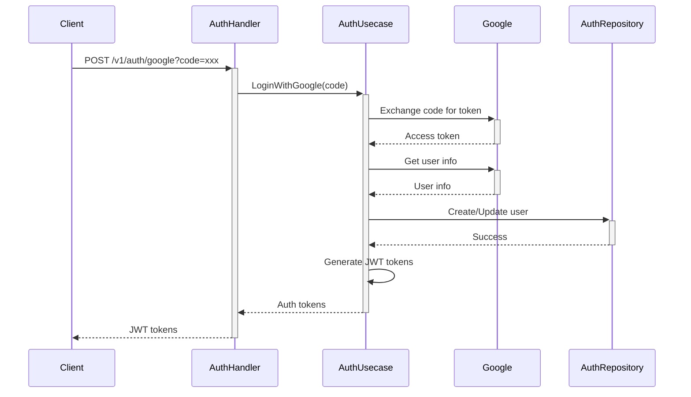
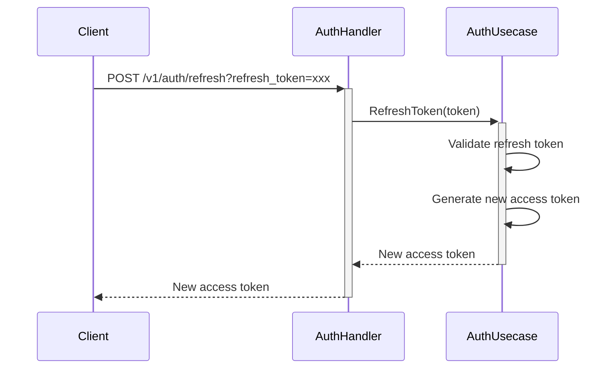
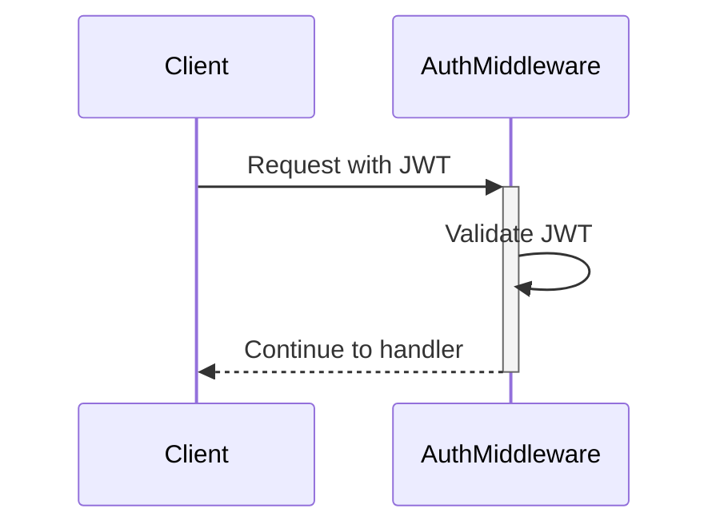

# Authentication Flow

## Overview

Jeki menggunakan Google OAuth 2.0 untuk autentikasi dan JWT untuk manajemen session. Flow autentikasi terdiri dari beberapa komponen utama:

1. **AuthHandler** - Menangani HTTP requests terkait autentikasi
2. **AuthUsecase** - Mengimplementasikan logika bisnis autentikasi
3. **AuthRepository** - Mengelola data autentikasi di database
4. **AuthMiddleware** - Memvalidasi JWT token untuk protected routes

## Flow Autentikasi

### 1. Google OAuth Login

### 2. Token Refresh

### 3. Protected Route Access

## Komponen

### AuthHandler

Menangani HTTP requests terkait autentikasi:
- `LoginWithGoogle` - Memproses Google OAuth callback
- `RefreshToken` - Memperbarui access token
- `Logout` - Mengakhiri session

### AuthUsecase

Mengimplementasikan logika bisnis autentikasi:
- Integrasi dengan Google OAuth
- Manajemen JWT tokens
- Validasi user

### AuthRepository

Mengelola data autentikasi di database menggunakan GORM:
- Menyimpan user data
- Mengelola refresh tokens
- Tracking session

### AuthMiddleware

Middleware untuk protected routes:
- Validasi JWT token
- Ekstrak user info dari token
- Menolak request yang tidak valid

## Konfigurasi

Autentikasi membutuhkan beberapa konfigurasi:

1. **Google OAuth**:
   - Client ID
   - Client Secret
   - Redirect URL

2. **JWT**:
   - Secret key
   - Access token TTL
   - Refresh token TTL

Semua konfigurasi ini diatur melalui environment variables.

## Error Handling

1. **Invalid OAuth Code**:
   - Status: 401 Unauthorized
   - Message: "Failed to authenticate with Google"

2. **Invalid Refresh Token**:
   - Status: 401 Unauthorized
   - Message: "Invalid refresh token"

3. **Invalid JWT**:
   - Status: 401 Unauthorized
   - Message: "Unauthorized"

## Security Considerations

1. **JWT Security**:
   - Access token TTL pendek (15 menit)
   - Refresh token TTL lebih panjang (7 hari)
   - Secure secret key

2. **OAuth Security**:
   - Validasi state parameter
   - Secure redirect URI
   - HTTPS required

3. **Database Security**:
   - Encrypted sensitive data
   - Secure password hashing
   - Session tracking 